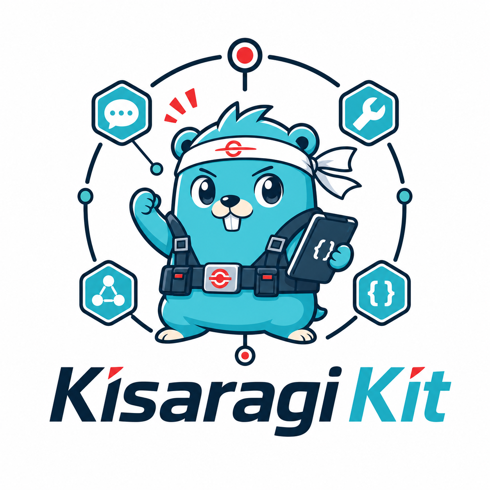

# Kisaragi Kit



Small Go framework for LLM apps, with an OpenAI-compatible adapter. It gives this repo a reusable core for:

- streaming chat completions
- typed tool registration
- JSON schema generation from Go structs
- tool-call execution loops
- stateful agents
- agents exposed as tools for delegation

## Name

Kisaragi Kit is a nod to the Kisaragi Corporation from *Combatants Will Be Dispatched!*: a small, reusable kit for dispatching agents, wiring specialist helpers together, and turning agents into callable tools.

## Install

```bash
go get github.com/beowulf20/kisaragi-kit
```

## Packages

| Package | Purpose |
| --- | --- |
| `pkg/llm` | Provider-neutral message types, completion loop, hook events, tool-call transcript handling. |
| `pkg/llm/tool` | Generic `NewTool[I, O]` helper, toolbox registry, JSON schema generation, typed input decoding. |
| `pkg/llm/agent` | Stateful agents with persistent messages, transient runs, streaming hooks, and `AsTool()` delegation. |
| `pkg/llm/provider/openai` | OpenAI-compatible client adapter, streaming conversion, model listing, and tool/message translation. |

## Quickstart

```go
package main

import (
	"context"
	"fmt"
	"log"
	"os"
	"time"

	"github.com/beowulf20/kisaragi-kit/pkg/llm"
	"github.com/beowulf20/kisaragi-kit/pkg/llm/agent"
	openaiadapter "github.com/beowulf20/kisaragi-kit/pkg/llm/provider/openai"
	llmtool "github.com/beowulf20/kisaragi-kit/pkg/llm/tool"
)

type weatherInput struct {
	City string `json:"city" description:"City to check"`
}

type weatherOutput struct {
	Summary string `json:"summary"`
}

func main() {
	client, _, err := openaiadapter.NewClient(openaiadapter.ClientConfig{
		BaseURL: "https://api.openai.com/v1",
		APIKey:  os.Getenv("OPENAI_API_KEY"),
		Timeout: 60 * time.Second,
	})
	if err != nil {
		log.Fatal(err)
	}

	tools := llmtool.NewToolbox()
	err = tools.RegisterTool(llmtool.NewTool("weather", "Gets current weather.", func(_ context.Context, input weatherInput) (weatherOutput, error) {
		return weatherOutput{Summary: "clear skies in " + input.City}, nil
	}))
	if err != nil {
		log.Fatal(err)
	}

	assistant, err := agent.NewAgent(agent.NewAgentInput{
		Name:         "assistant",
		SystemPrompt: "Answer briefly. Use tools when they help.",
		Config: llm.CompletionCallInput{
			Client: client,
			Model:  "gpt-4o-mini",
			Tools:  *tools,
		},
		Hooks: agent.Hooks{
			OnContentDelta: func(delta string) { fmt.Print(delta) },
		},
	})
	if err != nil {
		log.Fatal(err)
	}

	if _, err := assistant.CallWithUserMessage("What is the weather in Curitiba?"); err != nil {
		log.Fatal(err)
	}
}
```

Run the included example:

```bash
OPENAI_API_KEY=... go run ./examples/basic
```

For OpenAI-compatible local servers:

```bash
OPENAI_BASE_URL=http://localhost:11434/v1 OPENAI_API_KEY=local OPENAI_MODEL=llama3.1 go run ./examples/basic
```

## Core Concepts

### Messages

Use constructors from `pkg/llm`:

- `NewSystemMessage`
- `NewUserMessage`
- `NewAssistantMessage`
- `NewAssistantToolCallMessage`
- `NewToolMessage`

The completion loop returns appended assistant/tool messages through `CompletionCallOutput.Messages`, so callers can persist conversation history.

### Tools

Tools are normal Go functions:

```go
tool := llmtool.NewTool("lookup", "Looks up a record.", func(ctx context.Context, input lookupInput) (lookupOutput, error) {
	return lookupOutput{}, nil
})
```

Input structs become provider-neutral JSON schemas. Public fields are included, `json:"-"` fields are ignored, pointer fields and `omitempty` fields are optional, and `description` tags become schema descriptions.

### Agents

Agents wrap completion config plus message history:

```go
assistant, err := agent.NewAgent(agent.NewAgentInput{
	Name:         "researcher",
	SystemPrompt: "Be precise.",
	Config: llm.CompletionCallInput{
		Client: client,
		Model:  "gpt-4o-mini",
	},
})
```

Use `CallWithUserMessage` for normal conversation, `Run` to continue from existing state, and `RunWithTransientMessage` when extra context should be sent once without being stored.

### Agent Delegation

Any agent can become a tool:

```go
toolbox := llmtool.NewToolbox()
_ = toolbox.RegisterTool(researchAgent.AsTool())
```

This lets a coordinator agent call specialist agents using the same tool loop.

## Hooks

`CompletionHooks` and `agent.Hooks` support:

- `OnContentDelta` for streaming text
- `OnToolCall` before a tool runs
- `OnToolResult` after a tool returns or fails

## Tests

```bash
go test ./...
```

The test suite covers schema generation, typed tool calls, streaming content, tool-call messages, agent history, transient messages, and agent-as-tool behavior.

## Design Notes

- The framework core is provider-neutral; the OpenAI adapter targets OpenAI-compatible chat completion APIs.
- Tool execution is capped at eight rounds to prevent infinite loops.
- Tool errors are returned to the model as short JSON error payloads.
- The public API stays small: client setup, messages, completions, tools, and agents.
